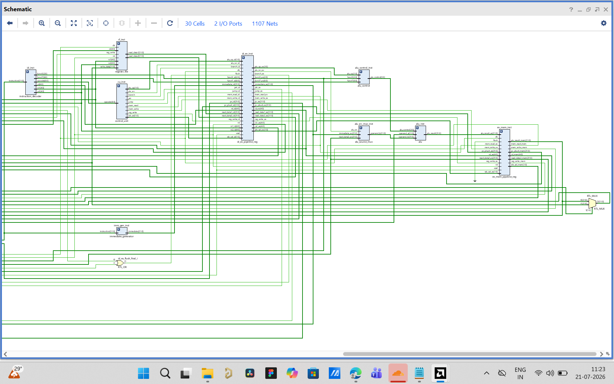
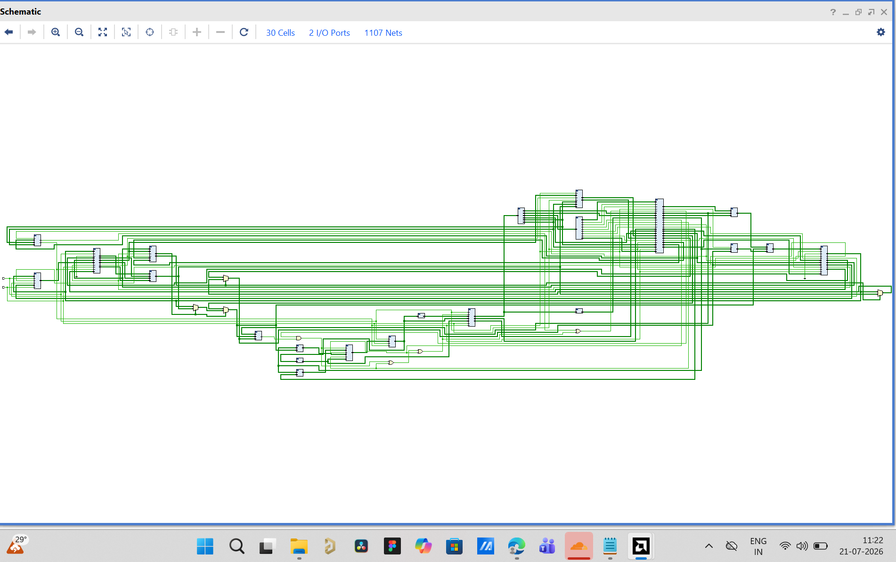
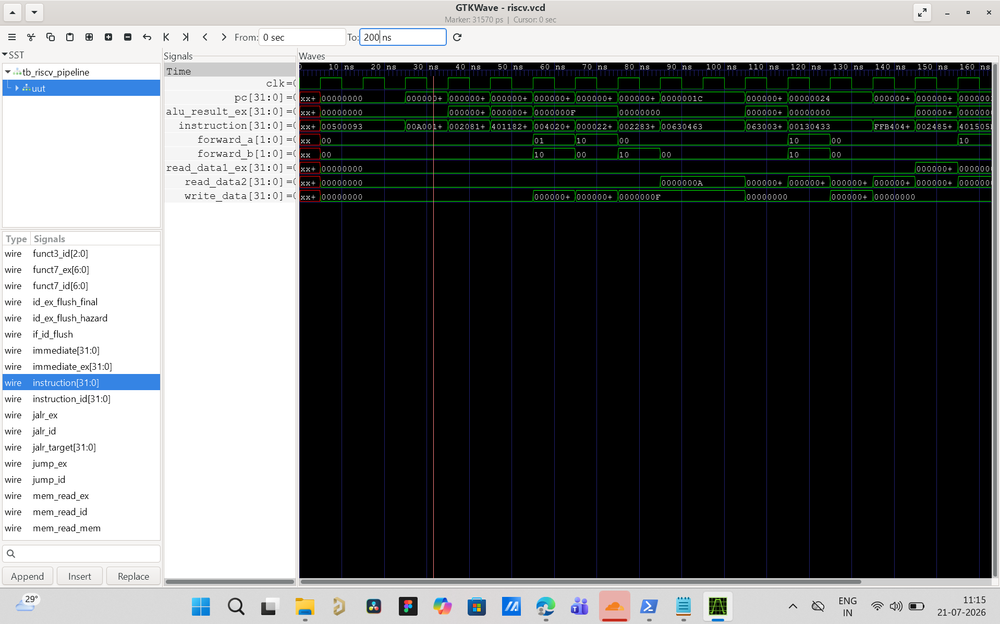

# 🚀 5-Stage Pipelined RV32I Processor


A **32-bit 5-stage pipelined RISC-V (RV32I) processor** implemented in **Verilog HDL**. The processor supports the base **RV32I instruction set** and includes **hazard detection**, **data forwarding**, and **branch handling** to enable efficient pipelined execution.

The design was verified using **GTKWave** waveform analysis, synthesized using **Yosys**, and analyzed using **Xilinx Vivado RTL Elaboration**.

---

## ✨ Features

- 32-bit RV32I Processor
- Classic 5-Stage Pipeline Architecture
- Instruction Fetch (IF)
- Instruction Decode (ID)
- Execute (EX)
- Memory Access (MEM)
- Write Back (WB)
- Hazard Detection Unit
- Data Forwarding Unit
- Branch & Jump Support
- Immediate Generator
- ALU Control Unit
- Register File
- Separate Instruction and Data Memory
- Pipeline Registers
- Functional Verification using GTKWave
- RTL Elaboration using Xilinx Vivado
- Logic Synthesis using Yosys

---

# 🏗️ Pipeline Architecture

```
                +----------------+
                | Instruction IF |
                +----------------+
                        │
                  IF/ID Register
                        │
                +----------------+
                | Instruction ID |
                +----------------+
                        │
                  ID/EX Register
                        │
                +----------------+
                | Execute (EX)   |
                +----------------+
                        │
                 EX/MEM Register
                        │
                +----------------+
                | Memory (MEM)   |
                +----------------+
                        │
                 MEM/WB Register
                        │
                +----------------+
                | Write Back WB  |
                +----------------+
```

---

# 📂 Repository Structure

```
5-Stage-Pipelined-RV32I-Processor/
│
├── rtl/
├── testbench/
├── images/
├── synthesis/
├── README.md
├── LICENSE
├── .gitignore
└── program.mem
```

---

# ⚙️ Pipeline Stages

### Instruction Fetch (IF)

- Program Counter
- Instruction Memory
- PC + 4 Adder
- Next PC Logic

### Instruction Decode (ID)

- Instruction Decoder
- Register File
- Immediate Generator
- Control Unit

### Execute (EX)

- Arithmetic Logic Unit (ALU)
- ALU Control
- Forwarding Unit
- Branch Comparator
- Branch Target Adder

### Memory Access (MEM)

- Data Memory
- Memory Read / Write

### Write Back (WB)

- Write Back Multiplexer
- Register File Update

---

# ⚠️ Hazard Handling

The processor resolves pipeline hazards using:

- Forwarding Unit
- Hazard Detection Unit

Load-use hazards are detected and stalled appropriately, while RAW hazards are minimized using data forwarding.

---

# 🌿 Branch Handling

Supported control-flow instructions:

- BEQ
- BNE
- BLT
- BGE
- JAL
- JALR

Branch decisions are computed in the Execute stage using the Branch Comparator and Branch Target Adder.

---

# 📋 Supported RV32I Instructions

### R-Type

- ADD
- SUB
- AND
- OR
- XOR
- SLL
- SRL
- SRA
- SLT
- SLTU

### I-Type

- ADDI
- ANDI
- ORI
- XORI
- SLLI
- SRLI
- SRAI
- SLTI
- SLTIU
- LW
- JALR

### S-Type

- SW

### B-Type

- BEQ
- BNE
- BLT
- BGE

### U-Type

- LUI
- AUIPC

### J-Type

- JAL

---

# 🧪 Verification

The processor functionality was verified using **GTKWave** by analyzing simulation waveforms for:

- Program Counter updates
- Pipeline execution
- Register File operations
- ALU functionality
- Memory read/write
- Data forwarding
- Hazard detection
- Branch execution
- Write-back stage

---

# 🛠️ Tools Used

| Tool | Purpose |
|------|---------|
| Verilog HDL | Hardware Description |
| GTKWave | Waveform Analysis & Debugging |
| Yosys | Logic Synthesis |
| Xilinx Vivado | RTL Elaboration & Design Analysis |
| Git & GitHub | Version Control |

---

# 📊 Synthesis Statistics

| Metric | Value |
|--------|------:|
| Total Cells | 1217 |
| D Flip-Flops | 333 |
| Memories | 3 |
| Memory Bits | 17,408 |
| RTL Submodules | 22 |

---

# 📸 Results

## RTL Schematic



---

## Complete RTL Design



---

## GTKWave Verification



---

## Yosys Synthesis


---

# 🚀 Future Improvements

- AI-Enhanced RV32I Processor
- Custom AI Instruction Extension
- Fixed-Point Arithmetic Engine
- Logistic Regression Hardware Inference
- FPGA Implementation
- ASIC Implementation using OpenLane & Sky130

---

# 📂 Repository

**GitHub Repository:**

https://github.com/YOUR_USERNAME/5-Stage-Pipelined-RV32I-Processor

---

# 📚 References

- RISC-V Unprivileged ISA Specification
- Computer Organization and Design – Patterson & Hennessy
- Yosys Open Synthesis Suite
- GTKWave
- Xilinx Vivado

---

# 👨‍💻 Author

**Daksh Maheshwari**

B.Tech in Electronics & Communication Engineering  
Birla Institute of Technology, Mesra

- GitHub: https://github.com/YOUR_USERNAME
- LinkedIn: https://www.linkedin.com/in/daksh-maheshwari-48612328a/

---

## ⭐ Support

If you found this project useful, consider giving it a **⭐ Star** on GitHub.
